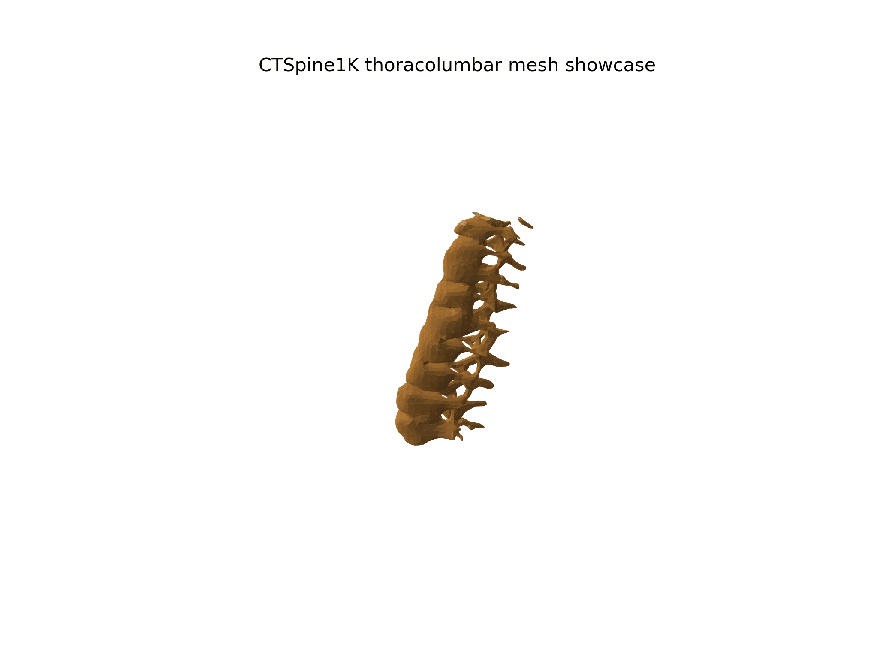

# Spine2Space

Geometry-aware sparse X-ray/DRR to 3D reconstruction prototype for medical-imaging R&D.

Spine2Space is a compact med-tech proof of concept inspired by X23D-style 2D-to-3D reconstruction: it ingests CTSpine1K CT volumes, generates sparse CT-derived DRR views, tracks projection metadata, reconstructs 3D occupancy volumes with PyTorch, and exports quantitative metrics plus inspectable 3D meshes.

This repository is intentionally presented in two layers:

- **Repo showcase:** visual, recruiter-friendly evidence that the 3D reconstruction pipeline exists.
- **Technical report:** a stricter `report.md` will document held-out Kaggle validation results for X23D-style discussion.

It does **not** claim clinical performance.

## Visual Showcase

The first visual milestone reconstructed/exported a thoracolumbar/lumbar spine mesh from CTSpine1K segmentation labels. This is a showcase artifact for people interested in 3D construction, medical visualization, and med-tech prototyping.



Showcase assets:

- `reports/showcase_assets/full_spine_lumbar_showcase.gif`
- `reports/showcase_assets/full_spine_lumbar_showcase.mp4`
- `reports/showcase_assets/full_spine_lumbar_viewer.html`
- `reports/showcase_assets/full_spine_lumbar_mesh.ply`

Important: this full-spine/lumbar mesh is a **visual reconstruction/export showcase**, not the held-out model-performance claim.

## What It Builds

```text
CTSpine1K CT + segmentation
        -> vertebra/region target extraction
        -> CT-intensity DRR proxy views
        -> projection matrices P = K[R|t]
        -> crop-adjusted metadata
        -> PyTorch 2D encoder + backprojection + 3D refiner
        -> voxel metrics, surface metrics, meshes, GIF/HTML viewers
```

Core components:

- CTSpine1K micro-dataset downloader and manifest builder.
- CT-intensity DRR proxy generation.
- L3 label extraction from CTSpine masks.
- Patient-level train/validation split.
- X23D-like PyTorch baseline.
- Voxel metrics: Dice/F1, IoU, precision, recall.
- Surface metrics: cKDTree ASSD, HD95, HD99.
- Point-cloud PLY and smooth marching-cubes mesh export.
- Kaggle notebook for GPU/hosted execution.

## Current R&D Status

Two tracks are intentionally separated:

| Track | Purpose | How to read it |
|---|---|---|
| Visual showcase | Make the 3D construction work visible | Good for repo visitors and recruiters |
| Held-out validation | Measure real generalization | Goes into `report.md`, not the README showcase |

The overfit demos prove that the data/model/evaluation contracts can learn one sample. The Kaggle real-split path is the more serious test: train patients and validation patients are separated.

Latest serious Kaggle run to be documented in `report.md`:

```text
Best ValF1: 0.2815
Best ValIoU: 0.1644
TrainF1: 0.3002
Val precision: 0.1667
Val recall: 0.9200
```

Interpretation: early positive signal, high recall, low precision, not clinical quality.

## Run Locally

Local Mac execution is for smoke tests and artifact inspection.

```bash
python -m pip install -e ".[model,medical,data,plots,visualization]"
python -m src.test_smoke
python -m src.cli --volume-size 16
python -m src.evaluate --volume-size 16 --output-dir runs/demo_eval
```

## CTSpine Micro Pipeline

```bash
python -m src.data.download_ctspine --output-dir data/raw/ctspine1k --max-pairs 20
python -m src.data.manifest --config configs/micro_ctspine.yaml
python -m src.drr.generator --config configs/micro_ctspine.yaml --limit 20
python -m src.train_overfit --config configs/real_overfit.yaml
python -m src.view_volume \
  --checkpoint runs/overfit_real/best.pt \
  --manifest data/processed/micro_ctspine/manifest.jsonl \
  --sample-index 0 \
  --output-dir runs/view_overfit_real
```

## Patient-Level Real Split

Use this for the non-overfit reconstruction check.

```bash
python -m src.data.download_ctspine --output-dir data/raw/ctspine1k --max-pairs 20
python -m src.data.manifest --config configs/real_split_prep.yaml --output data/processed/real_split/manifest.jsonl
python -m src.drr.generator --config configs/real_split_prep.yaml --manifest data/processed/real_split/manifest.jsonl --limit 20
python -m src.data.split_manifest \
  --manifest data/processed/real_split/manifest.jsonl \
  --train-output data/processed/real_split/manifest_train.jsonl \
  --val-output data/processed/real_split/manifest_val.jsonl
python -m src.train_real_split --config configs/kaggle_real_split.yaml
```

Kaggle notebook:

- `notebooks/kaggle_real_reconstruction.ipynb`

Kaggle source bundle:

- `dist/spine2space_kaggle_source.zip` is generated locally and uploaded to Kaggle when needed.

## 3D Assets

Generate 3D comparison assets from an evaluation run:

```bash
python -m src.render3d \
  --npz runs/view_overfit_real/volumes/prediction_target.npz \
  --output-dir reports/recruiter_assets

python -m src.mesh3d \
  --npz runs/view_overfit_real/volumes/prediction_target.npz \
  --output-dir reports/recruiter_assets
```

Typical outputs:

- `metrics.json`
- `threshold_sweep.csv`
- `qualitative/overlay_axial.png`
- `meshes/prediction_surface.ply`
- `meshes/target_surface.ply`
- `reports/*_assets/*.gif`
- `reports/*_assets/*.html`
- `reports/*_assets/*.ply`

## Repository Layout

- `src/core/`: configuration and typed schemas.
- `src/geometry/`: projection matrices and crop-adjusted geometry.
- `src/data/`: CTSpine discovery, medical IO, manifests, preprocessing, patient splits.
- `src/drr/`: CT-derived DRR proxy generation.
- `src/models/`: PyTorch layers and sparse X-ray-to-3D baseline.
- `src/training/`: overfit, subset, and real train/validation loops.
- `src/evaluation/`: voxel metrics, surface metrics, reports, visualizations, mesh export.
- `configs/`: reproducible micro, overfit, and Kaggle real-split configs.
- `notebooks/`: Kaggle execution notebook.
- `reports/`: repo showcase assets and recruiter-facing visual artifacts.

## What Not To Claim

Do not read the visual showcase as a clinical result. The correct statement is:

> Spine2Space demonstrates an end-to-end 2D-to-3D medical reconstruction workflow with real CT-derived inputs, explicit geometry metadata, patient-level validation support, and inspectable 3D outputs. Current validation is early R&D, not clinical-grade reconstruction.

## Next Steps

- Publish the serious X23D-facing `report.md` after the final Kaggle run.
- Increase patient count beyond the 20-pair micro-subset.
- Improve DRR physics and calibration perturbation testing.
- Add train/validation/test split reporting.
- Increase model capacity and evaluate false-positive control.
