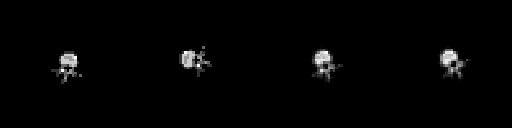
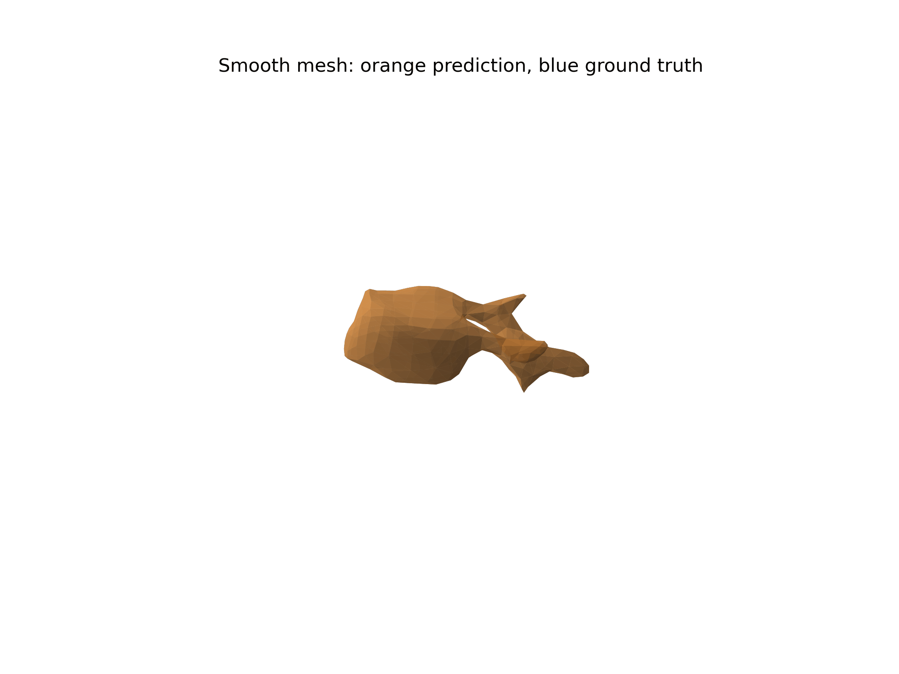

# Spine2Space

Med-tech 3D reconstruction showcase from sparse CT-derived X-ray/DRR views.

Spine2Space explores a practical 2D-to-3D medical-imaging workflow: CTSpine1K data, DRR-style views, PyTorch reconstruction, and inspectable 3D mesh exports. It is a research prototype and visual portfolio piece, not a clinical product.


## Showcase

The repo includes a visual 3D milestone: a thoracolumbar/lumbar mesh exported from CTSpine1K segmentation labels. It is meant to make the 3D construction pipeline immediately visible to recruiters, med-tech teams, and computer-vision reviewers.

Open or download:

- `reports/showcase_assets/full_spine_lumbar_showcase.mp4`
- `reports/showcase_assets/full_spine_lumbar_viewer.html`
- `reports/showcase_assets/full_spine_lumbar_mesh.ply`

## From 2D Views To 3D

Sparse CT-derived DRR views:



Reconstruction/target visual checks:


Smooth mesh export:



Interactive assets:

- `reports/recruiter_assets/11_reconstruction_interactive.html`
- `reports/recruiter_assets/14_L3_mesh_comparison_interactive.html`
- `reports/recruiter_assets/15_mesh_rotation.mp4`

## What This Demonstrates

- Medical-data ingestion from CTSpine1K.
- Sparse 2D DRR-style view generation.
- 3D occupancy reconstruction with a PyTorch baseline.
- Mesh export with point-cloud PLY and smooth marching-cubes surfaces.
- Quantitative evaluation hooks for Dice/F1, IoU, ASSD, and HD95.
- A Kaggle-ready path for patient-level train/validation experiments.

## Current Status

The visual demo is intentionally separated from model-quality claims. The showcase makes the 3D pipeline visible; the serious held-out validation results will live in `report.md` once the final Kaggle run is complete.

Latest Kaggle validation snapshot:

```text
Best ValF1: 0.2815
Best ValIoU: 0.1644
TrainF1: 0.3002
Val precision: 0.1667
Val recall: 0.9200
```

Interpretation: early R&D signal with high recall and low precision. Not clinical quality.

## Technical Details

Architecture, commands, pipeline diagrams, and Kaggle execution notes are documented in:

- [architecture.md](architecture.md)
- `notebooks/kaggle_real_reconstruction.ipynb`

## Scope

Spine2Space is a proof of concept for AI-assisted medical-imaging R&D. It should be read as evidence of end-to-end prototyping, data contracts, geometry-aware modeling, evaluation discipline, and 3D visualization capability.

It should **not** be read as a validated clinical reconstruction system.
