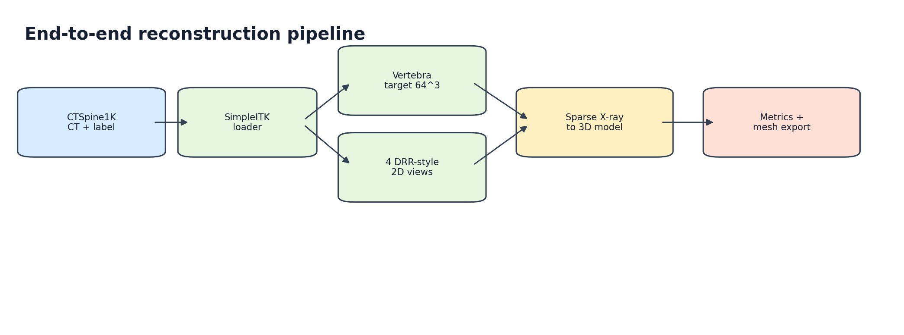
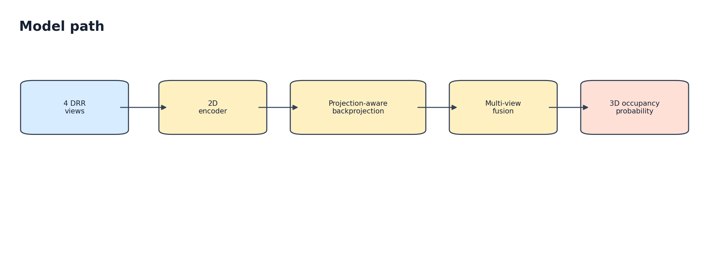
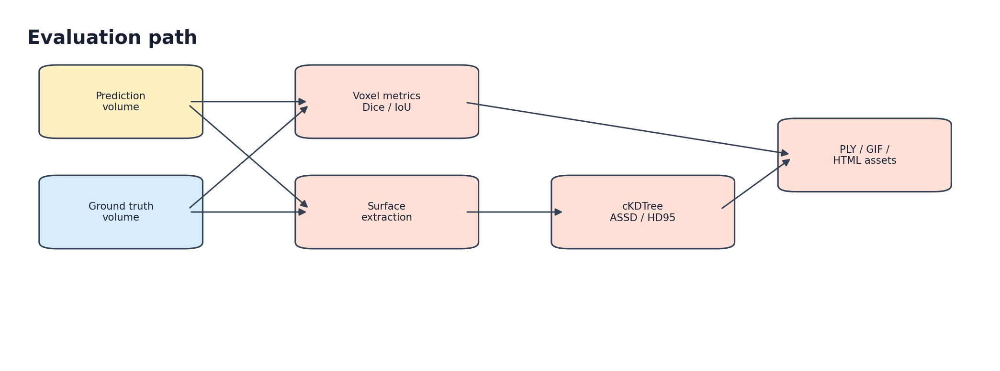

# Spine2Space Architecture

This document keeps the technical details out of the README and describes how the prototype is organized.

## System Overview



## Data Contract

Generated samples are `.npz` files with:

```text
images       [4, 1, 128, 128]
projections  [4, 3, 4]
target       [1, 64, 64, 64]
spacing_mm
patient_id
vertebra_label
```

The current CTSpine vertebra target uses label `22` for `L3`.

## Model Path



Implemented baseline:

- `src/models/sparse_xray_to_3d.py`
- `src/models/layers.py`

The model is deliberately small. It is meant to validate the data/model/evaluation loop before scaling capacity.

## Evaluation Path



Metrics:

- Dice / F1
- IoU
- precision / recall
- ASSD
- HD95 / HD99
- max surface distance

## Local Smoke Test

```bash
python -m pip install -e ".[model,medical,data,plots,visualization]"
python -m src.test_smoke
python -m src.cli --volume-size 16
python -m src.evaluate --volume-size 16 --output-dir runs/demo_eval
```

## CTSpine Micro Pipeline

```bash
python -m src.data.download_ctspine --output-dir data/raw/ctspine1k --max-pairs 20
python -m src.data.manifest --config configs/micro_ctspine.yaml
python -m src.drr.generator --config configs/micro_ctspine.yaml --limit 20
python -m src.train_overfit --config configs/real_overfit.yaml
python -m src.view_volume \
  --checkpoint runs/overfit_real/best.pt \
  --manifest data/processed/micro_ctspine/manifest.jsonl \
  --sample-index 0 \
  --output-dir runs/view_overfit_real
```

## Patient-Level Real Split

Use this for non-overfit evaluation.

```bash
python -m src.data.download_ctspine --output-dir data/raw/ctspine1k --max-pairs 20
python -m src.data.manifest --config configs/real_split_prep.yaml --output data/processed/real_split/manifest.jsonl
python -m src.drr.generator --config configs/real_split_prep.yaml --manifest data/processed/real_split/manifest.jsonl --limit 20
python -m src.data.split_manifest \
  --manifest data/processed/real_split/manifest.jsonl \
  --train-output data/processed/real_split/manifest_train.jsonl \
  --val-output data/processed/real_split/manifest_val.jsonl
python -m src.train_real_split --config configs/kaggle_real_split.yaml
```

Kaggle notebook:

```text
notebooks/kaggle_real_reconstruction.ipynb
```

Saved progression analysis:

```text
reports/real_split_comparison.md
```

## 3D Asset Export

```bash
python -m src.render3d \
  --npz runs/view_overfit_real/volumes/prediction_target.npz \
  --output-dir reports/reconstruction_assets

python -m src.mesh3d \
  --npz runs/view_overfit_real/volumes/prediction_target.npz \
  --output-dir reports/reconstruction_assets
```

Typical outputs:

```text
metrics.json
threshold_sweep.csv
qualitative/overlay_axial.png
meshes/prediction_surface.ply
meshes/target_surface.ply
*.gif
*.html
*.ply
```

## Repository Layout

```text
src/core/        configuration and typed schemas
src/geometry/    projection matrices and crop-adjusted geometry
src/data/        CTSpine discovery, medical IO, manifests, preprocessing, splits
src/drr/         CT-derived DRR proxy generation
src/models/      PyTorch sparse X-ray-to-3D baseline
src/training/    overfit, subset, and real train/validation loops
src/evaluation/  metrics, reporting, visualization, mesh export
configs/         reproducible run configs
notebooks/       Kaggle execution notebook
reports/         visual assets and experiment summaries
```

## Limitations

- DRRs are CT-derived proxies, not real intraoperative fluoroscopy.
- Current validation is early R&D and not clinical-grade.
- The model is intentionally small and underpowered.
- Meshes are visualization/export artifacts, not surgical-grade anatomical reconstructions.
