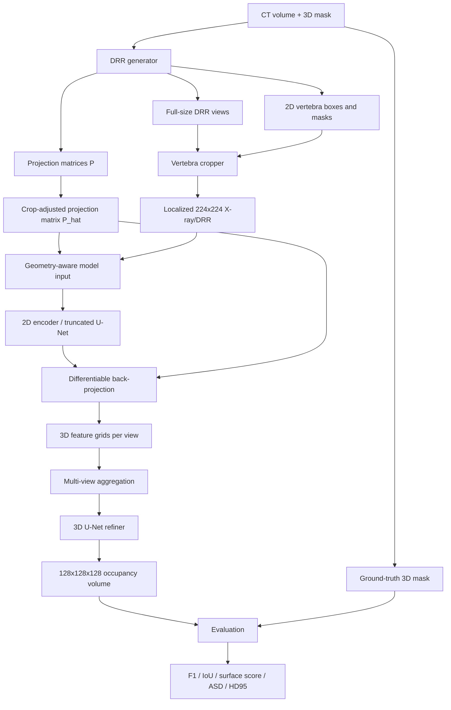

# Day 01-02 - X23D Paper-to-Code Map

## Scope

This document converts the X23D paper and the X23D R&D Intern job requirements into an implementation-ready technical map. It is the handoff artifact for the next phase: data and geometry MVP.

Target outcome for days 1-2:

- X23D pipeline diagram.
- Implementable module list.
- Data contracts and file formats.
- Metric definitions and validation plan.
- Risk register for early experiments.

## 1. Technical Thesis

X23D is not a generic image-to-volume model. Its core contribution is a geometry-aware sparse multi-view reconstruction pipeline:

1. Localized 2D X-ray/DRR views are extracted per vertebra.
2. Each view carries a calibrated projection matrix.
3. The crop operation updates the projection matrix.
4. A 2D encoder extracts image features.
5. Features are back-projected into a 3D feature grid using projection geometry.
6. Multi-view features are fused.
7. A 3D refiner predicts the vertebral occupancy volume.
8. The output is evaluated with voxel and surface metrics against CT-derived ground truth.

The candidate positioning for X23D should focus on this: "I can build and validate geometry-aware AI systems, not just train black-box models."

## 2. Pipeline Diagram



## 3. Paper Facts To Preserve In Code

| Area | X23D paper fact | Implementation implication |
|---|---|---|
| Input image size | Localized views resized to 224 x 224 | Standardize image tensor as `[V, 1, 224, 224]` |
| Output resolution | 128 x 128 x 128 voxel grid | Start with 64^3 for MVP, keep config-compatible with 128^3 |
| Views | 4-view baseline: AP, lateral, oblique, miscellaneous | Encode view category metadata explicitly |
| Geometry | Projection matrices are network inputs | Never discard camera metadata after image preprocessing |
| Crop handling | Crop shifts image plane and requires adjusted projection matrix | Implement `P_hat = Q @ P` in the geometry layer |
| 2D encoder | Truncated U-Net with skip connections | Implement minimal U-Net interface first |
| Back-projection | Project each 3D grid point into 2D feature maps and bilinearly interpolate | Use PyTorch `grid_sample` semantics |
| View fusion | Averaging strategy replaces memory-heavy GRU | Start with mean aggregation, design interface for attention later |
| Refiner | 3D U-Net outputs sigmoid occupancy | Binary occupancy output and thresholded metrics |
| Main benchmark | Pix2Vox++ without projection geometry underperforms on surface score | Benchmark narrative: geometry metadata is not optional |
| Known limitation | DRR-to-real-X-ray domain gap | Treat real-X-ray transfer as explicit risk, not afterthought |

## 4. Implementable Module List

### 4.1 `spine2space.data`

Purpose: load and normalize medical volumes, masks, DRRs, and annotations.

Responsibilities:

- Read CT volumes and segmentation masks.
- Preserve physical metadata: spacing, origin, orientation.
- Load or generate DRR images and metadata.
- Produce per-vertebra samples with fixed tensor shapes.
- Keep train/validation/test split at patient level.

Initial interfaces:

```python
@dataclass
class VolumeSample:
    patient_id: str
    volume: ArrayLike
    mask: ArrayLike
    spacing_mm: tuple[float, float, float]
    origin_mm: tuple[float, float, float]
    direction: tuple[float, ...]

@dataclass
class ReconstructionSample:
    sample_id: str
    patient_id: str
    anatomy_id: str
    views: list["ViewSample"]
    target_occupancy: ArrayLike
    target_spacing_mm: tuple[float, float, float]
```

Dependencies to evaluate:

- `SimpleITK` / `ITK` for medical image IO.
- `TorchIO` / `MONAI` for transforms and augmentation.
- `numpy`, `torch`, `pydantic` or dataclasses for schemas.

### 4.2 `spine2space.geometry`

Purpose: keep the reconstruction physically meaningful.

Responsibilities:

- Build camera intrinsics `K`.
- Build extrinsics `[R | t]`.
- Compose projection matrix `P = K [R | t]`.
- Adjust projection matrix after crop.
- Normalize world/voxel coordinates for differentiable sampling.
- Perturb calibration parameters for sensitivity analysis.

Initial interfaces:

```python
@dataclass
class ProjectionMatrix:
    matrix: ArrayLike  # shape: [3, 4]
    coordinate_frame: str
    source: str  # calibrated, synthetic, estimated

def adjust_projection_for_crop(
    projection: ProjectionMatrix,
    crop_x_px: float,
    crop_y_px: float,
) -> ProjectionMatrix:
    ...
```

X23D crop rule:

```text
P_hat = Q @ P

Q = [[1, 0, -tx],
     [0, 1, -ty],
     [0, 0,   1]]
```

Early tests:

- Identity crop leaves `P` unchanged.
- Positive crop offset shifts projected coordinates by the expected pixel delta.
- Batched projections preserve tensor dimensions.

### 4.3 `spine2space.drr`

Purpose: create or ingest multi-view simulated X-rays.

Responsibilities:

- Generate DRRs from CT volumes, or load precomputed DRRs.
- Store camera pose and focal length for each view.
- Store 2D bounding boxes and masks.
- Support four clinical view categories: AP, lateral, oblique, miscellaneous.

MVP decision:

- For days 3-5, implement a controlled placeholder DRR path if full physical DRR generation is too slow.
- The placeholder must still emit valid projection metadata so geometry code can be tested.

### 4.4 `spine2space.preprocessing`

Purpose: convert raw view data into model-ready localized inputs.

Responsibilities:

- Crop full-size DRRs/X-rays to anatomy-specific regions.
- Resize crops to 224 x 224.
- Normalize intensity to `[0, 1]`.
- Apply optional segmentation mask.
- Update projection matrix after crop.
- Package output as `ViewSample`.

Initial interface:

```python
@dataclass
class ViewSample:
    view_id: str
    view_category: Literal["ap", "lateral", "oblique", "misc"]
    image: ArrayLike          # [1, H, W]
    projection: ProjectionMatrix
    bbox_xywh: tuple[float, float, float, float]
    mask_2d: ArrayLike | None
```

### 4.5 `spine2space.models`

Purpose: host the X23D-like baseline.

Responsibilities:

- 2D encoder interface.
- Differentiable back-projection layer.
- Multi-view aggregation.
- 3D refiner.
- Occupancy prediction.

MVP shape contract:

```text
input.images:      [B, V, 1, 224, 224]
input.projections: [B, V, 3, 4]
features_2d:       [B, V, C, Hf, Wf]
features_3d:       [B, V, C3, D, H, W]
fused_3d:          [B, C3, D, H, W]
output:            [B, 1, D, H, W]
```

Baseline defaults:

- `V = 4`.
- `D = H = W = 64` for MVP.
- Configurable `D = H = W = 128` for paper-aligned experiments.
- Mean view aggregation first.

### 4.6 `spine2space.metrics`

Purpose: reproduce the evaluation language of X23D.

Responsibilities:

- Voxel F1/Dice.
- Voxel IoU.
- Surface score.
- ASD.
- HD95.
- Precision/recall breakdown.

Priority:

1. Implement F1 and IoU first because they are fast and require no mesh conversion.
2. Add surface metrics using mesh or point sampling once geometry MVP is stable.
3. Visualize false-positive and false-negative anatomical surfaces.

### 4.7 `spine2space.reporting`

Purpose: turn experiments into recruiter/team-friendly evidence.

Responsibilities:

- Save metrics as JSON/CSV.
- Save qualitative slices.
- Save mesh overlays.
- Produce a short markdown experiment report.

## 5. Data Contracts

### 5.1 Folder Layout

Proposed local layout:

```text
data/
  raw/
    ct/
    masks_3d/
  interim/
    drr_full/
    annotations_2d/
  processed/
    localized_views/
    occupancy_targets/
  splits/
    train_patients.txt
    val_patients.txt
    test_patients.txt

runs/
  YYYYMMDD_HHMM_experiment_name/
    config.yaml
    metrics.json
    qualitative/
    checkpoints/
```

Git policy:

- Keep `data/` and `runs/` out of Git.
- Commit schemas, code, configs, and small synthetic fixtures only.

### 5.2 `sample_manifest.json`

One manifest item should describe a full reconstruction sample:

```json
{
  "sample_id": "patient_0001_L3",
  "patient_id": "patient_0001",
  "anatomy_id": "L3",
  "target": {
    "occupancy_path": "data/processed/occupancy_targets/patient_0001_L3.npz",
    "shape": [128, 128, 128],
    "spacing_mm": [0.75, 0.75, 0.75]
  },
  "views": [
    {
      "view_id": "patient_0001_L3_ap_00",
      "category": "ap",
      "image_path": "data/processed/localized_views/patient_0001_L3_ap_00.png",
      "mask_path": null,
      "bbox_xywh": [104.0, 87.0, 224.0, 224.0],
      "projection_matrix": [
        [850.0, 0.0, 112.0, 0.0],
        [0.0, 850.0, 112.0, 0.0],
        [0.0, 0.0, 1.0, 0.0]
      ],
      "projection_source": "synthetic_drr"
    }
  ]
}
```

### 5.3 Tensor Contracts

| Name | Shape | Type | Notes |
|---|---:|---|---|
| `images` | `[B, V, 1, 224, 224]` | `float32` | normalized `[0, 1]` |
| `projection_matrices` | `[B, V, 3, 4]` | `float32` | crop-adjusted |
| `target_occupancy` | `[B, 1, D, H, W]` | `float32` or `bool` | binary target |
| `view_categories` | `[B, V]` | `str` or int enum | AP/lateral/oblique/misc |
| `spacing_mm` | `[B, 3]` | `float32` | needed for physical metrics |
| `sample_id` | `[B]` | `str` | reporting and failure case tracking |

## 6. Metrics Plan

### 6.1 Voxel Metrics

Use thresholded binary occupancy volumes:

```text
prediction_binary = prediction_probability >= threshold
```

Metrics:

- `precision = TP / (TP + FP)`
- `recall = TP / (TP + FN)`
- `F1 = 2 * precision * recall / (precision + recall)`
- `IoU = TP / (TP + FP + FN)`

Default threshold:

- `0.5` for initial experiments.
- Sweep `[0.3, 0.4, 0.5, 0.6, 0.7]` when comparing models.

### 6.2 Surface Metrics

Required to speak the X23D evaluation language:

- `surface_score`: harmonic mean of surface precision and surface recall at a distance threshold.
- `ASD`: average surface distance in millimeters.
- `HD95`: robust Hausdorff distance at the 95th percentile.

Implementation options:

- Use DeepMind `surface-distance` for parity with the paper if dependency setup is acceptable.
- Use `scikit-image` marching cubes + `Open3D`/`scipy.spatial.cKDTree` for a transparent fallback.

Threshold:

- Paper uses `d = 1%` of reconstruction volume side length for surface score.
- Also report millimeter-scale thresholds once spacing is reliable.

### 6.3 Breakdown Metrics

For a convincing R&D report, aggregate metrics by:

- anatomy level: L1/L2/L3/L4/L5 or hip/thoracic target;
- view configuration: 2, 4, 8 views;
- segmentation mode: unsegmented, grayscale segmented, binary segmented;
- calibration noise level;
- patient-level split.

## 7. Initial Experiment Matrix

| Experiment | Goal | Success criterion |
|---|---|---|
| `E01_voxel_identity` | Validate metrics on identical target/prediction | F1 = 1.0 and IoU = 1.0 |
| `E02_projection_crop` | Validate `P_hat = Q @ P` | Projected points shift by crop offset |
| `E03_placeholder_multiview` | Validate data contract without full DRR | Batch has correct tensor shapes |
| `E04_backprojection_smoke` | Validate differentiable sampling path | Forward pass returns expected 3D feature shape |
| `E05_tiny_overfit` | Check baseline can overfit one sample | Training loss decreases on one sample |
| `E06_calibration_noise` | Estimate sensitivity to focal/pose perturbation | Monotonic or explainable degradation |

## 8. Risks And Mitigations

| Risk | Why it matters | Mitigation |
|---|---|---|
| DRR generation takes too long | Blocks days 3-5 | Start with placeholder/projection test, then replace with physical DRR |
| Metadata drift after crop/resize | Model receives inconsistent geometry | Treat crop adjustment as tested geometry primitive |
| 128^3 volumes exceed local memory | Slows iteration | MVP at 64^3, config path to 128^3 |
| Surface metrics are dependency-heavy | Evaluation can stall | Implement voxel metrics first, add surface-distance fallback |
| DRR-to-real-X-ray gap | Core clinical risk | Track segmentation-assisted and domain adaptation paths explicitly |
| Patient leakage | Inflated results | Split by patient before generating sample batches |

## 9. Decisions Locked For Days 3-5

- Build a small Python package layout rather than a single notebook.
- Use explicit dataclasses or schemas for every sample.
- Keep projection matrices as first-class data, never hidden in filenames.
- Start with 64^3 occupancy for local iteration.
- Implement geometry tests before model training.
- Report all experiments in markdown + JSON.

## 10. Next Step Checklist

For days 3-5:

- Create package skeleton: `spine2space/`.
- Implement `ProjectionMatrix` and crop adjustment.
- Add unit tests for projection/crop behavior.
- Add a tiny synthetic sample generator.
- Add voxel metric functions.
- Add a CLI smoke command that prints sample tensor shapes.
