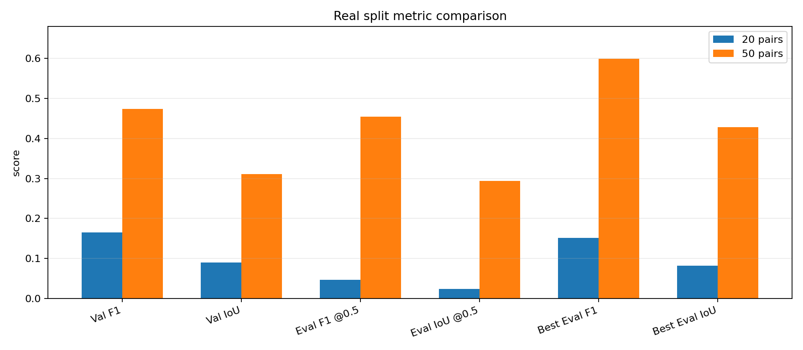
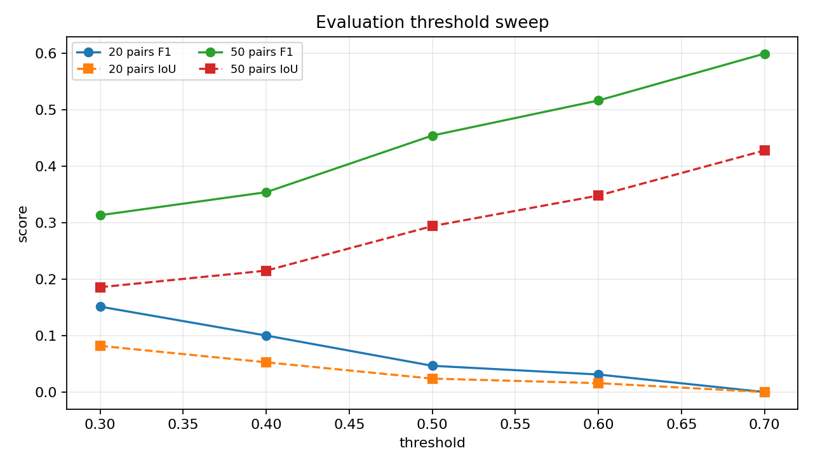
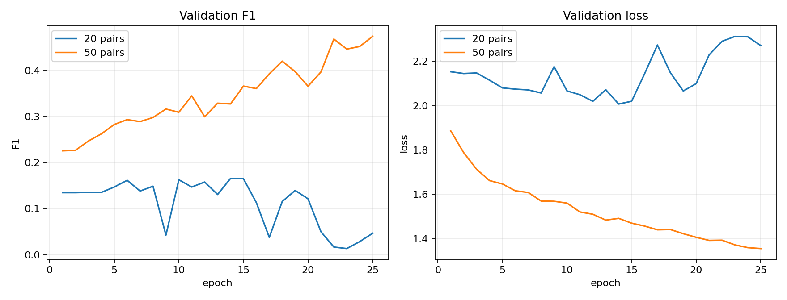
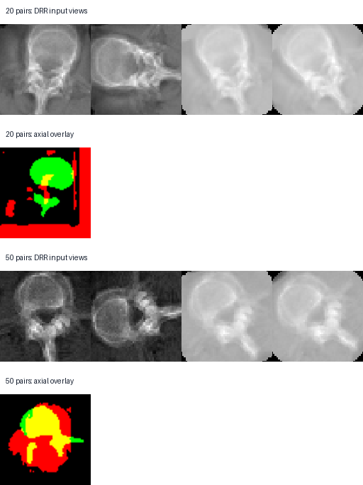

# Real Split Progression: 2 -> 20 -> 50 Pairs

This report compares the saved Kaggle real-split outputs. The 2-patient phase was a smoke/overfit sanity check, so it is not a fair generalization benchmark. The comparable held-out runs are the 20-pair and 50-pair exports.

## Executive Summary

- Moving from 20 to 50 CT/mask pairs changed the run from a weak/localization failure to a meaningful reconstruction signal.
- Best validation F1 improved from `0.1655` to `0.4735`.
- Best held-out evaluation F1 after threshold sweep improved from `0.1513` to `0.5992`.
- ASSD improved from `9.3690 mm` to `3.4485 mm`.
- HD95 improved from `19.8409 mm` to `9.1256 mm`.

## Metric Comparison

| Metric | 20 pairs | 50 pairs | Delta |
|---|---:|---:|---:|
| Best validation F1 | `0.1655` | `0.4735` | `+186.2%` |
| Best validation IoU | `0.0902` | `0.3110` | `+244.8%` |
| Eval F1 @ threshold 0.5 | `0.0465` | `0.4542` | `+876.5%` |
| Eval IoU @ threshold 0.5 | `0.0238` | `0.2938` | `+1134.1%` |
| Best eval F1 after threshold sweep | `0.1513` | `0.5992` | `+296.2%` |
| Best eval IoU after threshold sweep | `0.0818` | `0.4278` | `+422.8%` |
| ASSD mm, lower is better | `9.3690` | `3.4485` | `-63.2%` |
| HD95 mm, lower is better | `19.8409` | `9.1256` | `-54.0%` |

## Threshold Behavior

- 20-pair best threshold: `0.3` with F1 `0.1513`.
- 50-pair best threshold: `0.7` with F1 `0.5992`.
- The 50-pair model benefits from a stricter threshold, which means it learned stronger confidence separation but still tends to over-segment at threshold 0.5.

## Training Dynamics

- 20-pair best epoch: `14`; final validation F1 collapsed to `0.0465`.
- 50-pair best epoch: `25`; final validation F1 stayed at `0.4735`.
- The 50-pair run is more stable and keeps improving through epoch 25.

## Qualitative Difference

The 50-pair output is visibly more localized. It still predicts extra volume, but the target structure is captured much more consistently than in the 20-pair run.

## Scale Interpretation

| Stage | Role | What it proves | What it does not prove |
|---|---|---|---|
| 2 patients | Smoke/overfit/debug | Code path, data loading, forward/backward pass | Generalization |
| 20 pairs | First held-out real split | Metrics export, patient split, failure visibility | Reliable reconstruction |
| 50 pairs | Stronger micro-dataset | Meaningful held-out signal and better surface distances | Clinical-grade accuracy |

## Recruiter Framing

The honest message is: increasing the micro-dataset size materially improved held-out reconstruction quality. The system is not clinically validated, but the pipeline now demonstrates the engineering loop X23D cares about: data ingestion, DRR generation, projection-aware modeling, patient-level validation, metric tracking, and 3D artifact export.

Useful 50-pair assets:

- `reports/comparison_assets/50_pairs_14_mesh_comparison_interactive.html`
- `reports/comparison_assets/50_pairs_15_mesh_rotation.gif`
