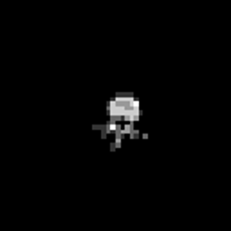
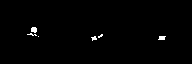
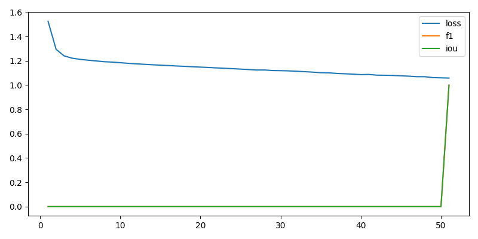
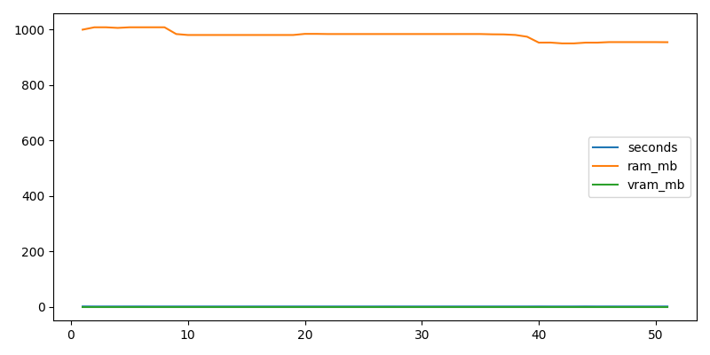
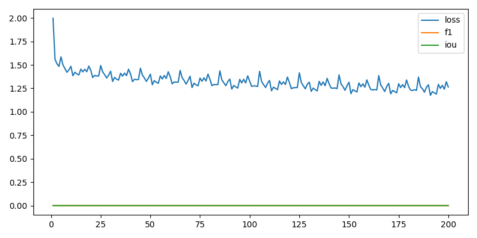
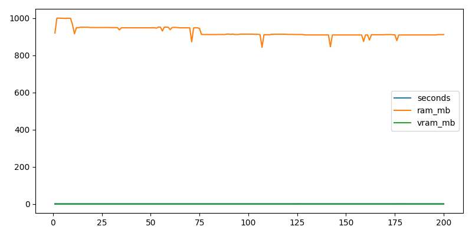
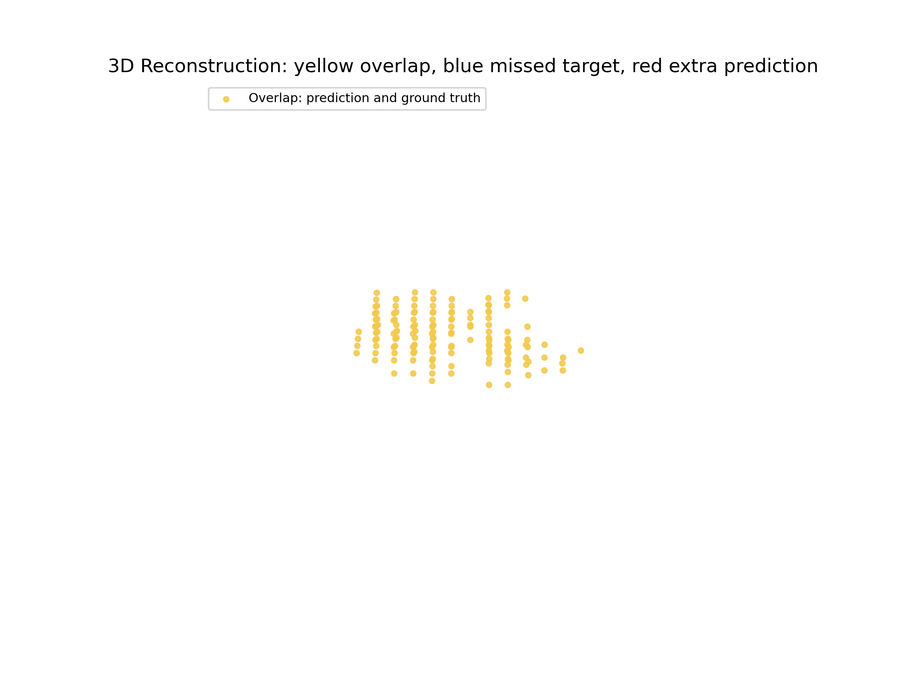

# Spine2Space - X23D Interview Report

## 1. One-Minute Summary

Spine2Space is a compact proof-of-concept inspired by X23D: it takes real CTSpine1K CT volumes, generates sparse 2D DRR proxy views, preserves projection matrices, reconstructs a 3D occupancy volume, and evaluates the output against CT-derived segmentation ground truth.

This is not a clinical-performance claim. It is an engineering demonstration that the full R&D loop works: medical data ingestion, 2D view generation, geometry metadata, PyTorch training, checkpoint reload, 3D visualization, and quantitative evaluation.

Important framing for the recruiter:

> I coordinated and directed this implementation with Codex as the coding agent. I did not manually type every line. My contribution was problem framing, technical direction, validation criteria, prompt-level iteration, and interpretation of results. The result demonstrates that I can drive an AI-assisted R&D workflow from paper understanding to a reproducible prototype.

## 2. Why This Matches X23D

The job asks for:

- Python and PyTorch.
- Computer vision and 3D geometry.
- 2D medical image to 3D reconstruction.
- Ground-truth benchmarking.
- Medical dataset preprocessing.
- Translation of research ideas into working code.

This PoC directly targets those requirements:

```text
Real CT 3D + segmentation mask
        -> CT-derived 2D DRR proxy views
        -> projection matrices P = K[R|t]
        -> crop-adjusted matrices P_hat = Q @ P
        -> geometry-aware 2D-to-3D model
        -> 3D occupancy reconstruction
        -> F1 / IoU / surface-distance evaluation
```

## 3. What Was Built

Core capabilities:

- Micro CTSpine1K downloader and manifest builder.
- CT-derived 2D DRR proxy generation.
- Vertebra-level target extraction: `L3` is isolated with CTSpine label `22`, instead of using the whole nonzero spine mask.
- Four-view input setup: AP, lateral, oblique, miscellaneous.
- 64 x 64 x 64 voxel reconstruction target.
- PyTorch model with 2D encoder, differentiable back-projection, multi-view fusion, and 3D refiner.
- Training loops for synthetic overfit, real-sample overfit, and 20-sample subset training.
- Checkpoint save/reload.
- Voxel metrics, surface metrics, runtime/memory telemetry.
- 2D images, point-surface PLY, smooth mesh PLY, overlays, plots, GIF, and MP4 exports.

## 4. Visual Evidence

### 4.1 Input: Four 2D DRR Proxy Views

These are the sparse 2D inputs generated from the CT volume.


Animated version:



Important note:

- These are not clinical fluoroscopy images.
- They are CT-derived proxy DRRs used to validate the 2D multi-view pipeline.
- The views are intentionally small, 128 x 128, for fast PoC execution.
- They can look visually similar because each view projects the same small vertebral crop at low resolution. The current generator applies different projection orientations, and the exported sample was checked numerically: AP/lateral, AP/oblique, AP/misc, and oblique/misc have nonzero mean absolute image differences.

View sanity check:

```text
AP vs lateral mean absolute difference: 0.01575
AP vs oblique mean absolute difference: 0.01069
AP vs misc mean absolute difference:    0.01248
oblique vs misc difference:             0.00717
```

How to explain this:

> The views are not meant to look like polished radiographs. They are compact CT-derived DRR proxies. The important R&D contract is that the data loader returns multiple 2D views, each paired with a 3 x 4 projection matrix, and the downstream model consumes that geometry consistently.

### 4.2 Output: Prediction vs Ground Truth Overlay

This axial overlay compares the model prediction against the CT-derived ground truth.


Color interpretation:

- Red: predicted reconstruction.
- Green: ground truth.
- Yellow: overlap.

### 4.3 Orthogonal Slices

Prediction:



Ground truth:


### 4.4 Training Curves

Real-sample overfit clinical metrics:



Real-sample overfit engineering metrics:



20-sample subset clinical metrics:



20-sample subset engineering metrics:



### 4.5 3D Surfaces

Rotating 3D comparison:



Video file:

- `reports/recruiter_assets/10_reconstruction_rotation.mp4`

Color interpretation:

- Yellow: overlap between prediction and ground truth.
- Blue: target voxels missed by the model.
- Red: extra predicted voxels not present in the target.

Interactive browser viewer:

- `reports/recruiter_assets/11_reconstruction_interactive.html`

Open this HTML file in a browser to rotate, zoom, and toggle the three traces.

Open these in MeshLab, Blender, CloudCompare, or Open3D:

- `reports/recruiter_assets/prediction_surface.ply`
- `reports/recruiter_assets/target_surface.ply`

These PLY files are point-surface exports from the voxel volumes. They are sufficient for quick visual inspection but are not yet polished marching-cubes meshes.

### 4.6 Smooth Mesh Export

The point-cloud PLY files are useful for debugging, but they do not look like anatomy. For recruiter presentation, the same thresholded volumes were converted into triangular meshes with marching cubes and light smoothing.

Smooth mesh files:

- `reports/recruiter_assets/12_prediction_mesh_smooth.ply`
- `reports/recruiter_assets/13_target_mesh_smooth.ply`
- `reports/recruiter_assets/14_mesh_comparison_interactive.html`
- `reports/recruiter_assets/14_L3_mesh_comparison_interactive.html`
- `reports/recruiter_assets/15_mesh_rotation.gif`
- `reports/recruiter_assets/15_mesh_rotation.mp4`


Mesh size:

```text
Prediction mesh: 336 vertices, 672 faces
Target mesh:     336 vertices, 672 faces
```

Important note:

- Voxel metrics are still computed on the original 64 x 64 x 64 binary volumes.
- The mesh is a visualization/export artifact.
- Marching cubes and smoothing make the surface easier to inspect, but they do not improve the model numerically.

## 5. Key Results

| Experiment | Purpose | Result |
|---|---|---:|
| Synthetic overfit | Prove the model/loss/checkpoint path can learn | F1 0.9304, IoU 0.8698 |
| Real L3 overfit | Prove learning on one isolated CTSpine-derived L3 sample | F1 1.0000, IoU 1.0000 |
| Real checkpoint evaluation | Reload model and evaluate same L3 sample | F1 1.0000, IoU 1.0000 |
| 20-sample L3 subset training | Prove real data loader/training loop works | Final F1 0.0000, BestF1 0.0112 |

The most important result is real-sample overfit. It proves that the CT-derived 2D views, projection matrices, model, loss, checkpointing, and evaluation are internally coherent.

The 20-sample subset result is intentionally weak. It shows the pipeline runs end-to-end on multiple real CT-derived samples, not that the model generalizes clinically.

Why the real-sample overfit looks almost perfect:

- The model is evaluated on the same CT-derived sample it was trained to memorize.
- This is an intentional overfit test, not held-out validation.
- The target is a clean voxel occupancy grid generated from the CT segmentation, not noisy real fluoroscopy.
- The target is a single isolated L3 label, not the full CTSpine nonzero mask.
- The volume is downscaled to 64 x 64 x 64, so small geometric details are simplified.
- The model has only one geometry to learn, so memorization is expected if the pipeline is coherent.

Correct interpretation:

> The high score proves that the model/data/evaluation contract is learnable on one real CT-derived sample. It does not prove medical generalization.

## 6. Metric Glossary

### F1 / Dice

F1, also called Dice score in segmentation, measures volume overlap:

```text
Dice = 2 * intersection / (prediction + ground_truth)
```

Meaning:

- 1.0 is perfect overlap.
- 0.0 is no overlap.
- Our real L3 overfit: `1.0000`.

### IoU

Intersection over Union measures overlap more strictly:

```text
IoU = intersection / union
```

Meaning:

- 1.0 is perfect.
- Lower than Dice for the same prediction.
- Our real L3 overfit: `1.0000`.

### Precision

Precision asks:

```text
Of what the model predicted, how much was correct?
```

Our value: `1.0000`.

Meaning: the model produced essentially no false-positive voxels in this overfit sample.

### Recall

Recall asks:

```text
Of the true target, how much did the model recover?
```

Our value: `1.0000`.

Meaning: the model recovered all thresholded target voxels in this memorized L3 sample.

### Surface Score

Surface score measures how much of the predicted and target surfaces are close to each other within a tolerance.

Our value: `1.0000`.

Meaning: the reconstructed surface exactly matches the thresholded target surface in the overfit sample.

### ASD

ASD means Average Symmetric Surface Distance.

It measures the average distance between predicted surface points and target surface points.

Our value: `0.0000 mm`.

Meaning: average surface error is zero after thresholding in this overfit case.

### HD95

HD95 means 95th percentile Hausdorff Distance.

It asks:

```text
How large is the surface error if we ignore the worst 5% outliers?
```

Our value: `0.0000 mm`.

This looks suspicious at first, so it was checked. In this corrected L3 overfit run the thresholded prediction exactly matches the thresholded target, so HD95, HD99, ASD, and max surface distance are all zero.

### HD99

HD99 is the 99th percentile surface distance.

Our value: `0.0000 mm`.

Meaning: there is no measured surface mismatch after thresholding in this memorized sample.

### Max Surface Distance

Maximum observed surface distance.

Our value: `0.0000 mm`.

Meaning: the worst residual surface miss is zero in this thresholded overfit sample.

### Nonzero Surface Distance Fraction

Fraction of surface distances that are not exactly zero.

Our value: `0.0000`, or 0%.

Meaning: no surface points differ after thresholding in this memorized L3 sample.

## 7. Real-Sample Overfit Metrics

Final checkpoint evaluation:

```text
F1 / Dice:                         1.0000
IoU:                               1.0000
Precision:                         1.0000
Recall:                            1.0000
Surface score:                     1.0000
ASD:                               0.0000 mm
HD95:                              0.0000 mm
HD99:                              0.0000 mm
Max surface distance:              0.0000 mm
Nonzero surface distance fraction: 0.0000
```

Voxel-level explanation:

```text
Predicted voxels: 164
Target voxels:    164
Intersection:     164
False positives:  0
False negatives:  0
```

Interpretation:

- The thresholded prediction exactly matches the thresholded L3 target.
- This is possible because the model was trained to memorize this same sample.
- It does not hallucinate extra anatomy in this sample.
- This is expected for an overfit proof, not a generalization claim.

## 8. 20-Sample Subset Training

Final subset run:

```text
Patients/samples: 20
Epochs:           10
Steps:            200
F1 / Dice:        0.0000
IoU:              0.0000
Precision:        0.0000
Recall:           0.0000
BestF1:           0.0112
BestIoU:          0.0056
Loss:             1.2639
Throughput:       1.42 items/sec
RAM:              912 MB
VRAM:             0 MB on local Mac
```

Interpretation:

- The training loop works on multiple real CT-derived samples.
- The current small model does not generalize from the 20 isolated L3 samples under this CPU-scale configuration.
- This is not yet a useful generalizing model.
- The next work is better DRR fidelity, GPU training, stronger model capacity, and patient-level validation.

## 9. What To Say In The Interview

Use this:

> I built a compact X23D-style reconstruction PoC using AI-assisted development. Under my technical direction, the system ingests CTSpine1K CT volumes, isolates an L3 vertebra label, generates sparse 2D DRR proxy views, preserves projection matrices, reconstructs a 3D occupancy grid, and evaluates against CT-derived segmentation ground truth. The model overfits one real L3 sample at F1 1.0000 and runs a 20-sample training pipeline end-to-end, proving that the data, geometry, training, checkpointing, and evaluation infrastructure is coherent.

Also say this clearly:

> This is not a clinical-performance model. It is a pipeline-correctness and learning-capability demonstration. The next technical bottlenecks are DRR realism, generalization, and validation on held-out patients.

## 10. What Not To Claim

Do not say:

- "This achieves medical-grade reconstruction."
- "This reproduces X23D paper performance."
- "This is validated on real fluoroscopy."
- "The subset model generalizes."

Correct statement:

- The pipeline uses CT-derived DRR proxies, not real fluoroscopy.
- The real overfit proves the model can learn one CT-derived sample.
- The subset training proves the infrastructure runs on multiple samples.
- Generalization remains future work.

## 11. Which Files Matter

Presentation report:

- `reports/recruiter_report.md`

Presentation assets:

- `reports/recruiter_assets/`

Important runs:

- `runs/overfit_real`
- `runs/view_overfit_real`
- `runs/subset_train`

Ignore debug runs:

- `runs/demo_eval`
- `runs/eval_overfit_check*`
- `runs/overfit_check*`
- `runs/overfit_final*`

## 12. Next Technical Steps

1. Replace proxy DRR generation with a more physical X-ray simulation.
2. Train on GPU with larger model capacity and more epochs.
3. Add strict patient-level train/validation/test split reporting.
4. Add calibration perturbation sensitivity tests.
5. Compare mean fusion with attention-based multi-view fusion.
6. Replace proxy mesh smoothing with physically scaled anatomical mesh export.
